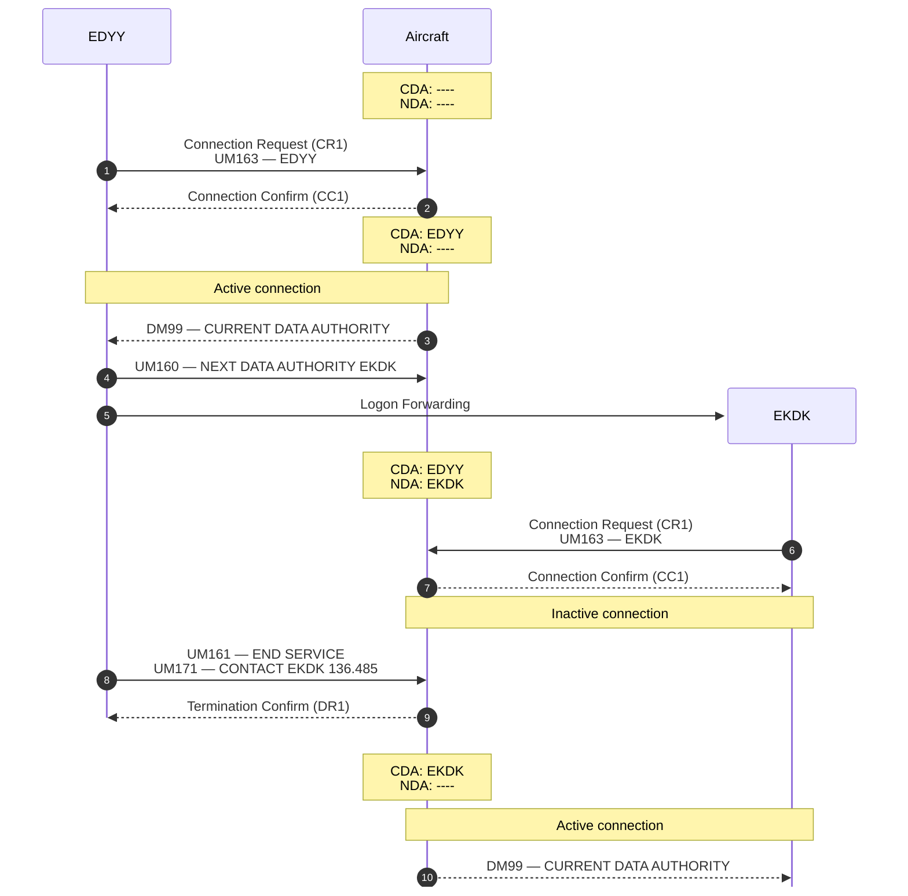
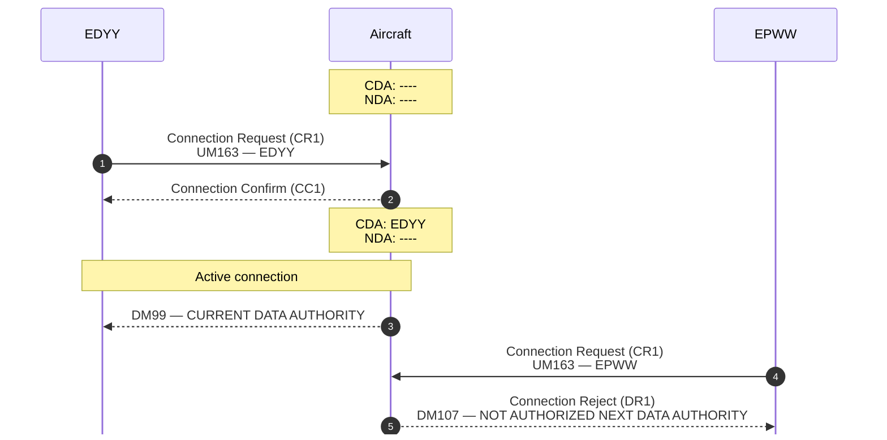
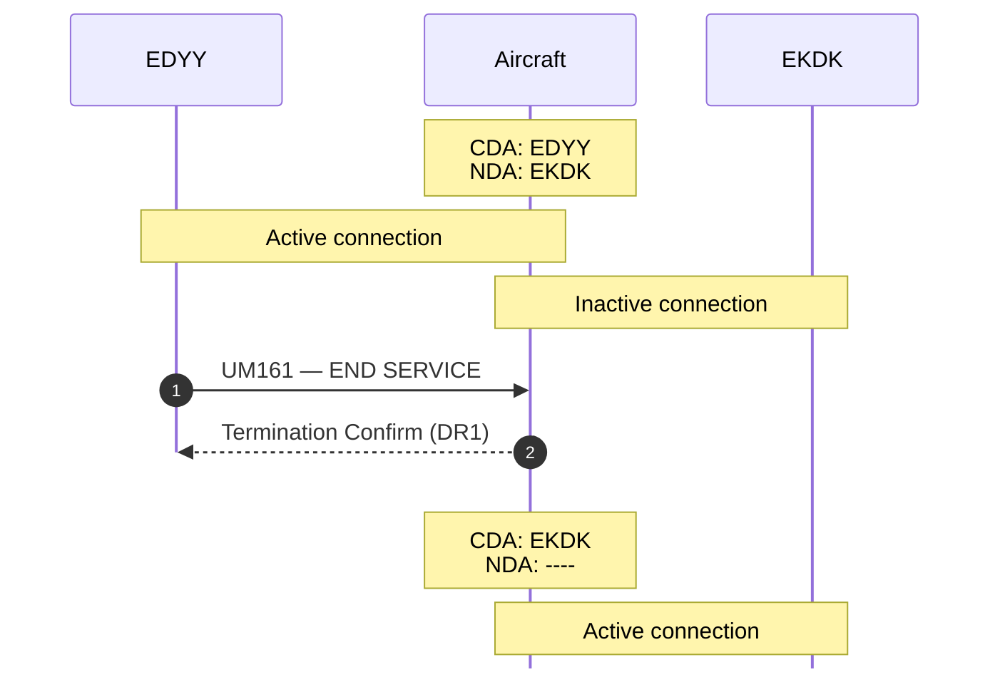

Once an aircraft successfully logs onto the CPDLC network, it may begin initiating **connections** with ATSUs and exchange messages. A connection is a separate concept from DLIC, and is only possible once an aircraft is logged on.

At any time the aircraft may have at most two connections: one active connection with the **Current Data Authority (CDA)**, and one inactive connection with the **Next Data Authority (NDA)**. Managing these connections is done with a combination of special message types and standard [uplink](/spec/cpdlc/uplink) and [downlink](/spec/cpdlc/downlink) messages. Please refer to the respective guides for more information on sending CPDLC messages.

An aircraft shall only exchange messages with the CDA, except when sending [connection rejections](#reject) to unauthorized ATSUs. If an aircraft receives any CPDLC uplink from the NDA or another ATSU, it shall respond with `DM63 — NOT CURRENT DATA AUTHORITY`. The inactive connection with the NDA is only activated when the active connection with the CDA is [terminated](#terminating-connections), at which point the NDA automatically becomes the CDA.

See the diagram below for an example illustrating these concepts:



## Initiating Connections

Connections are always initiated by ATSUs, most often when an aircraft first logs onto the CPDLC network or when an existing logon is forwarded to another controller. It is up to the aircraft, however, to determine if the connection is accepted or not.

Upon reciving a connection request, the following logic is used to determine whether the connection is accepted or rejected:

1. If the aircraft **does not** have a CDA, it shall:
    1. respond to the request with a [connection confirm](#confirm) message; and
    2. establish the new connection as the CDA.
2. If the aircraft has a CDA and the requesting ATSU is designated as the NDA, it shall:
    1. respond to the request with a [connection confirm](#confirm) message; and
    2. establish the new connection, but keep it inactive until the active connection is terminated.
3. If the aircraft has a CDA and the requesting ATSU is **not** designated as the NDA, it shall:
    1. respond with a [connection reject](#reject) message.

:::tip[Request for Comments]
In real-world operations, ATN B1 equipped aircraft will send `DM99 — CURRENT DATA AUTHORITY` upon establishing an ATSU as the CDA. FANS 1/A equipped aircraft do not have this automatic functionality, and ATSUs are expected to wait for the first downlink message to confirm that a connection is active.

The examples presented on this website currently use `DM99`, but there is a question of whether or not aircraft should be required to send it and whether or not ATSUs should be using it as an indicator of an active connection.

One approach, which appears relatively straightforward yet customizable for different regions, is to require aircraft to send `DM99` upon establishing a CDA, and allow FIRs to determine if their controller client will listen out for the message or ignore the message and wait for another downlink.
:::

Below is an example of two ATSUs attempting to initiate a connection to an aircraft, only one of which is allowed by the aircraft:



The connection from `EDYY` is immediately accepted because the aircraft does not yet have a CDA. The connection from `EPWW` is immediately rejected because the aircraft has established `EDYY` as the CDA and `EPWW` has not been designated as the NDA. If `EDYY` were to terminate the connection or forward the logon onto `EPWW`, then the second connection would be accepted and `EPWW` would be established as the CDA.


### Request

A connection request message is sent by an ATSU to an aircraft to establish itself as the CDA. The aircraft must be logged onto the CPDLC network before this request is sent. Airborne clients that have not yet logged on shall ignore any incoming connection requests.

A connection request message shall have a type of `CR1` and shall include `UM163 — [ICAO facility designation]` as the sole message element. See below for an example:

```json ""CR1"" collapse={8-9, 11-12}
{
    "method": "CPDLC",
    "payload": {
        "type": "CR1",
        "elements": [
            { "id": "UM163", "parameters": [{ "type": "facility", "ident": "EDYY" }] }
        ],
        "min": 0,
        "mrn": null
    },
    "station": "EKDK",
    "timestamp": 1757825970
}
```


### Confirm

A connection confirmation message is sent by an aircraft to an ATSU to accept an incoming connection request. This will establish an active connection if the ATSU automatically becomes the CDA, or an inactive connection if the ATSU is the designated NDA.

A connection confirmation message shall have a type of `CC1` and shall not have any message elements. See below for an example:

```json ""CC1"" collapse={6-7, 9-10}
{
    "method": "CPDLC",
    "payload": {
        "type": "CC1",
        "elements": [],
        "min": 0,
        "mrn": 0
    },
    "station": "EKDK",
    "timestamp": 1757825970
}
```

### Reject

A connection rejection message is sent by an aircraft to an ATSU to reject an incoming connection request. An aircraft may reject a connection for any reason, but most often it occurs when the aircraft already has a CDA and the requesting ATSU is not designated as the NDA.

A connection rejection message shall have a type of `DR1` and may optionally include `DM107 — NOT AUTHORIZED NEXT DATA AUTHORITY` as the sole message element. See below for an example:

```json ""DR1"" collapse={8-9, 11-12}
{
    "method": "CPDLC",
    "payload": {
        "type": "DR1",
        "elements": [
            { "id": "DM107", "parameters": [] }
        ],
        "min": 0,
        "mrn": 0
    },
    "station": "EKDK",
    "timestamp": 1757825970
}
```

## Terminating Connections

Similar to initiating connections, terminating connections is always done by ATSUs, most often when an aircraft leaves the controller's sector. It is once again up to the aircraft to determine whether or not the termination is accepted or not.

Upon reciving a termination request, the following logic is used to determine whether the termination is accepted or rejected:

1. If the termination request **does not** require a response (i.e. it does not include `UM117` or `UM120`), the aircraft shall:
    1. respond to the request with a [termination confirm](#confirm-1) message; and
    2. promote the NDA, if one exists, to be the CDA.
2. If the termination request **does** require a response and the pilot responts with `DM0 WILCO`, the aircraft shall:
    1. respond to the request with a [termination confirm](#confirm-1) message; and
    2. promote the NDA, if one exists, to be the CDA.
3. If the termination request **does** require a response and the pilot responts with `DM1 UNABLE`, the aircraft shall:
    1. respond to the request with a [termination reject](#reject-1) message.

Below is an example of a successful termination with an NDA that eventually becomes the CDA:



### Request

A termination request message is sent by an ATSU to an aircraft to begin tearing down an active CPDLC connection.

A termination request message shall have a type of `UP` (standard uplink message), and must include `UM161 — END SERVICE` as a message element. The termination request may also optionally include one of `UM117 — CONTACT [unit name] [frequency]` or `UM120 — MONITOR [unit name] [frequency]`. See below for an example:

```json ""UP"" collapse={15-16, 18-19}
{
    "method": "CPDLC",
    "payload": {
        "type": "UP",
        "elements": [
            { "id": "UM161", "parameters": [] },
            {
                "id": "UM117",
                "parameters": [
                    { "type": "unit", "ident": "EKDK", "name": "COPENHAGEN", "func": 0 },
                    { "type": "freq-vhf", "vhf": 136485 }
                ]
            }
        ],
        "min": 0,
        "mrn": null
    },
    "station": "EKDK",
    "timestamp": 1757825970
}
```

### Confirm

A termination confirmation message is sent by an aircraft to an ATSU to finish tearing down an active CPDLC connection. This will automatically promote an inactive connection to be the active connection once the confirmation is sent.

A termination confirmation message shall have a type of `DR1` and shall not have any message elements. See below for an example:

```json ""DR1"" collapse={6-7, 9-10}
{
    "method": "CPDLC",
    "payload": {
        "type": "DR1",
        "elements": [],
        "min": 0,
        "mrn": 0
    },
    "station": "EKDK",
    "timestamp": 1757825970
}
```

### Reject

A termination rejection message is sent by an aircraft in response to a termination request from an ATSU to indicate that an active connection could not be terminated. This can happen for one of two reasons:

1. there is no active connection because the the ATSU is not the CDA, in which case the aircraft shall respond with `DM63 — NOT CURRENT DATA AUTHORITY`; or
2. the termination request includes `UM117 — CONTACT` or `UM120 — MONITOR` to which the the flight crew respond to with `DM1 UNABLE`.

A termination request message shall have a type of `DN` (standard downlink message), and must include either `DM63 — NOT CURRENT DATA AUTHORITY` or `DM1 — UNABLE` as the sole message element. See below for an example:

```json ""DN"" collapse={8-9, 11-12}
{
    "method": "CPDLC",
    "payload": {
        "type": "DN",
        "elements": [
            { "id": "DM1", "parameters": [] }
        ],
        "min": 0,
        "mrn": 0
    },
    "station": "EKDK",
    "timestamp": 1757825970
}
```
