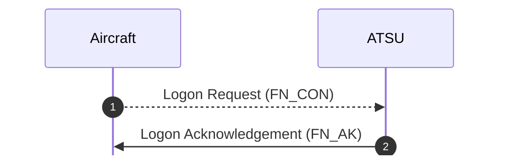
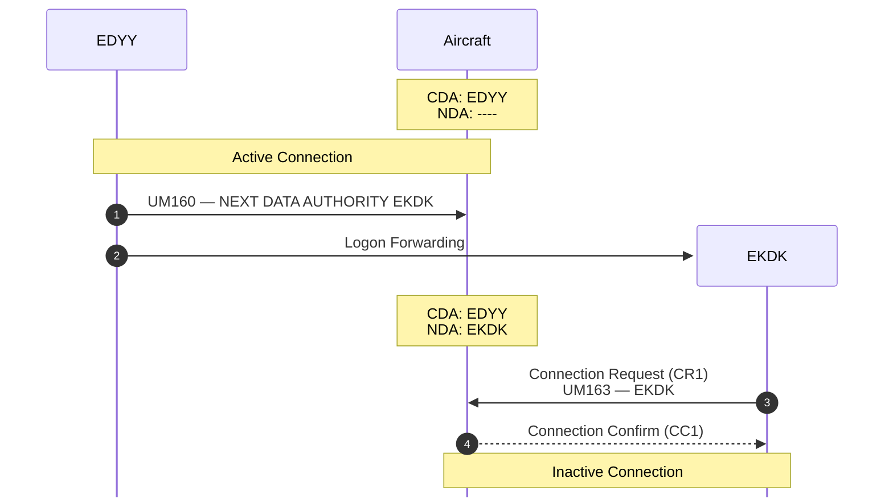

Before an aircraft can perform any communication with an **Air Traffic Services Unit (ATSU)**, it must "logon" to the data link network. Data link logons are either sent from aircraft to ATSU or from one ATSU to another. The method used to perform these logons is known as **Data Link Initiation Capability (DLIC)**. Below is a typical exchange between an aircraft and ATSU using DLIC.



When logging on, aircraft provide a four-character ICAO identifier for the ATSU they want to connect to. This is typically a unique code per FIR, such as `EDYY` for Maastricht; however, there are some exceptions such as the `KUSA` logon code, which is used for the entirety of the FAA's National Airspace System regardless of the specific ARTCC or sector.

An aircraft that is not logged onto the CPDLC network is unable to establish connections and exchange messages with ATSUs. Provider clients shall ignore any pre-formatted CPDLC messages sent by airborne clients that have not successfully logged onto the network.


### Payload

All DLIC payloads forllow the following JSON schema:

```json {"1":2} {"2":4} {"3":5} {"4":6} """" "{}"
{
    "method": "DLIC",
    "payload": {
        "type": "",
        "facility": "",
        "data": {}
    }
}
```

1. The `method` field shall always be `DLIC` to differentiate the messages from pre-formatted CPDLC messages.
2. The `type` field shall be either `FN_CON` for [Logon Request](#logon-request) or `FN_AK` for [Logon Acknowledgement](#logon-acknowledgement).
3. The `facility` field shall be the the logon code of the ATSU receiving or sending the message.
4. The `data` object varies depending on the `type` of the message. It's structure shall follow the schema provided in each type's respective section.


## Logon Request

An initial logon request is performed by an aircraft that does not have an active data link logon, such as when:

- preparing for departure;
- entering an area where data link services are available from an area where they are not; or
- when instructed by ATC (e.g. following a failed data link transfer).

When performing a logon request, the aircraft must provide information that allows the ATSU to link the request to an existing flight plan. This includes:

- `ident` -- the aircraft's callsign, which must match field 7 in an ICAO flight plan;
- `dep_icao` -- the four-character ICAO identifier of the departure airfield, which must match field 13 in an ICAO flight plan; and
- `arr_icao` -- the four-character ICAO identifier of the arrival airfield, which must match field 16 in an ICAO flight plan.

The payload for a logon request has a `type` of `FN_CON`, and includes the aforementioned flight plan information in the `data` field. Below is an example of a logon request payload:

```json
{
    "method": "DLIC",
    "payload": {
        "type": "FN_CON",
        "facility": "KUSA",
        "data": {
            "ident": "DAL104",
            "dep_icao": "KMIA",
            "arr_icao": "KBOS"
        }
    }
}
```

:::note
Logon requests are only sent by airborne clients to provider clients, and never the other way around. Provider clients must not send logon requests to airborne clients.
:::


## Logon Acknowledgement

A logon acknowledgement is sent by an ATSU to an aircraft that has performed a logon request. The request may or may not be successful, and an ATSU may reject a logon for any reason.

Upon receiving a logon request, an ATSU shall attempt to correlate the provided flight information with a filed flight plan. If the logon is successfully correlated, the ATSU responds with status code `0` for success, otherwise the ATSU responds with status code `1` for failure. ATSUs may also validate aircraft position information to ensure that they are within or near the facility they are attempting to logon to.

The payload for a logon response has a `type` of `FN_AK`, and includes the status code in the `data` field. Below is an example of a logon acknowledgement payload:

```json
{
    "method": "DLIC",
    "payload": {
        "type": "FN_AK",
        "facility": "KUSA",
        "data": {
            "status": 0
        }
    }
}
```

:::note
Logon acknowledgements are only sent by provider clients to aircraft clients, and never the other way around. Airborne clients must not send logon requests to provider clients.
:::


## Logon Forwarding

There is a special case in which an aircraft must be routed from one ATSU onto another. This occurs when an aircraft is transitioning airspaces managed by different ground stations (e.g. LSAZ to EDMM). In this case, the aircraft does not need to perform a logon request, and this is instead processed by the ground stations.

Below is a typical exchange between an aircraft and two ATSUs involving logon forwarding. Note that "Connection Request," "Connection Confirm," "Termination Request," and "Termination Confirm" are CPDLC messages, not DLIC, and are discussed in greater detail under [Connection Management](/spec/cpdlc/connections).



The key idea behind logon forwarding is that the current ATSU informs the aircraft of the next ATSU using `UM160 — NEXT DATA AUTHORITY [facility]`, and then communicates directly with the next ATSU to transfer the logon information provided in the initial logon request. The new ATSU should perform the same data correlation verification as described in [Logon Acknowledgement](#logon-acknowledgement) before initiating a connection request.

:::note
Since logon forwarding is completely transparent to the aircraft, FSDLP does not make any specific requirements for how this is implemented at the network level.
:::
